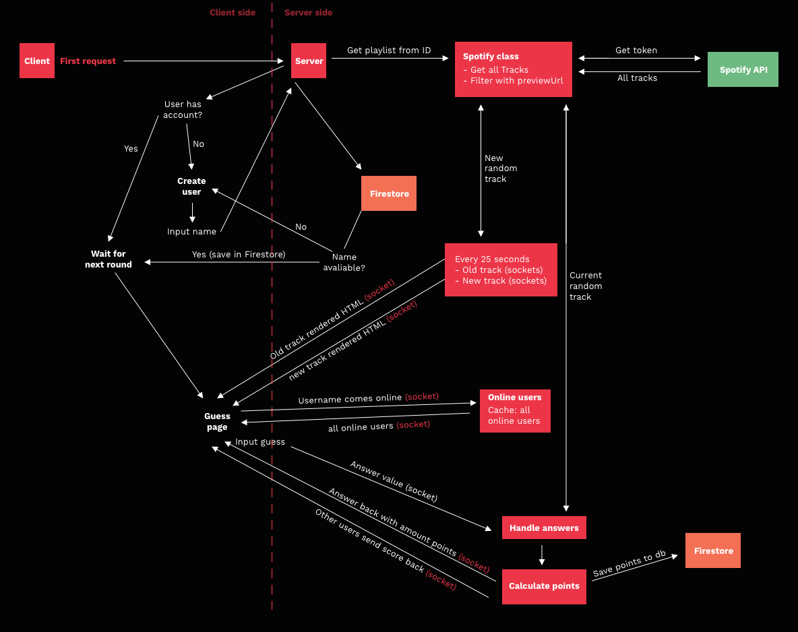

# Guess the track

[Link](https://57f97d56.ngrok.io)

## Guess the track

Guess is a quiz-a-like game where every 25 seconds a new song comes and you have to guess it, beating the other onlne players. Test your knowledge of music.

How faster you are the more points you can earn. It is build with a stack of express, socket.io, handlebars and firebase.

## Challanges

Well the big challange was to get the correct data flow, because so many things are happening at the same time. Also you have to give constant feedback to the users and load in data on the right moment. Data is changing very quickly and the whole app have to react to that.

But you don't want things that they are depending on eachother, no spaghetti code.

It took several iterations to get it right but the current flow looks like this.



## Install

1. Clone the project

2. First you need some things to set up, create a `.env` file and create a [firebase database](https://firebase.google.com/) and sign up for the [spotify api](https://developer.spotify.com/documentation/web-api/).

3. Fill up the .env with all correct keys and url's, the secret cookie can be everything :)

```
SPOTIFY_clientId=
SPOTIFY_clientSecret=

SECRET_COOKIES=

FIREBASE_apiKeyAIzaSyAjr1Nz7uaHHcokei5rXBKTMpLJfbFFjyU
FIREBASE_authDomain=
FIREBASE_databaseURL=
FIREBASE_propjectId=
FIREBASE_messagingSenderId=
```

4. Than run `npm install` to install all the packages

5. `npm run watch` to view online at `localhost:5554`

## How to use

Well a-lot is happening, it is a is [isomorphic app](https://www.lullabot.com/articles/what-is-an-isomorphic-application). In the page request first renders only the layout, than afterwards all the HTML will be rendered on the server and will be injected inside the DOM where it needs to be.

The main part of this app is the class called `spotifyApiClass`. It creates one time only a token to fetch all the tracks in the playlist wiht a cool smart recursive loop. You also have to give it a playstlist URL from spotify and it fetches all the tracks, filtering it where previews are avaliable and gives a random track on command. When you ask a random track it stores all the tracks in a cache and you can't have duplicates till every track is used.

There is a track loop what every 25 seconds gives to every playing user a rendered html block served with websockets. So everybody will get the same track on the same moment.

**Currently disabled**

People can guess with the input to the track and artists, the more artists the less points each they give. I use a small package called [string-similarity](https://www.npmjs.com/package/string-similarity) to match the answer, so when you type `Ed sheran` instead of `Ed Sheeran` you still get points but for the fault in your answer a little less points.

Well for now this approach doesn't work with such edge cases. Let's the current track is `Frank Ocean - solo`. If people just type out Frank Ocean it works fine, but if they guess the whole answer in 1 time. The approach doesn't work.

So currently now you have only 1 guess, and you have to get it **right**. The mini algoritm check for every possible case and assigns points based on what was correctly in the string.

There is a firebase store with it to store the users,their points and their total amount of guesses for now.

## Data

Well, I use mostly just the regular spotify data without slicing much away. I don't expose it to the user and render every data only on the server and compile it to HTML such as:

```js
app.render(
  'partials/track-history',
  { track: data, layout: false },
  (err, html) => {
    io.emit('history-track', {
      html
    })
  }
)
```

All the avaliable spotify data can ben found at [the spotify web-api reference](https://developer.spotify.com/documentation/web-api/reference/tracks/get-track/).

## Future ideas

- [ ] Leaderboards (most points, guesses etc.)
- [ ] Keep track of more statics
- [ ] A better way of keeping track who's online
- [ ] Dedicated log-in system
- [ ] People can use their spotify account to log-in
- [ ] Multiple room support for different genres
- [ ] Players can create their own rooms
- [ ] Players can create a password for their room
- [ ] Save how many times a song is guessed
- [ ] More animation, smoother experience
- [ ] Working equalizer based on the current track
